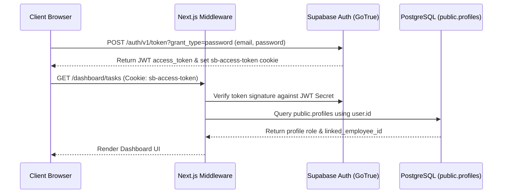

# NEOS Platform — Authentication Architecture

**Last Updated:** 2026-07-24  

---

## 1. Authentication Flow Overview

NEOS Platform uses Supabase GoTrue Auth for user identity, JWT generation, and session management.

---

## 2. Key Secret Specifications

* **Staging Provider**: Self-Hosted GoTrue (`https://supabase.neosfacility.com/auth/v1`)
* **JWT Signing Secret**: `PGRST_JWT_SECRET` (`ChangeThisToASuperSecureJWTSecretKey123!`)
* **Anon Key**: HMAC-SHA256 token scoped to `role: anon`
* **Service Role Key**: HMAC-SHA256 token scoped to `role: service_role` with bypass RLS privileges.
