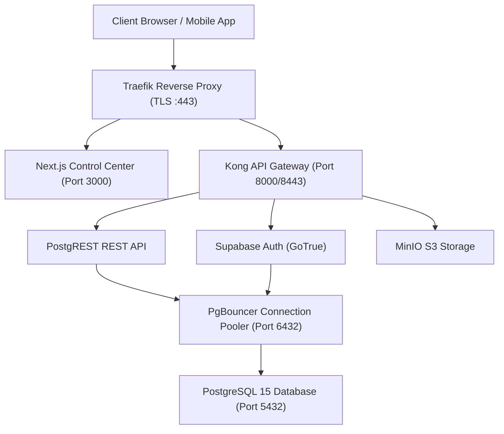

# NEOS Platform — System Architecture

**Last Updated:** 2026-07-24  
**Target Environments:** Hostinger VPS Staging (`https://test.neosfacility.com`), Vercel Production (`https://webapp.neosfacility.com`)  

---

## 1. High-Level Architecture Overview

NEOS Platform is a multi-tenant Enterprise SaaS facility & operational management suite built on a decoupled hybrid microservice and shared container infrastructure.

---

## 2. Component Specifications

### 2.1 Edge & Routing Layer
* **Traefik Reverse Proxy**: Handles Let's Encrypt TLS termination, automatic SSL renewal, HTTP -> HTTPS redirects, security headers, rate limiting, and gzip compression.
* **Kong API Gateway**: Manages JWT verification, rate limiting, and CORS headers for public API endpoints.

### 2.2 Application Layer
* **Next.js Control Center**: Serves frontend dashboards, server-side API routes, and operational management modules (`/dashboard/tasks`, `/dashboard/admin/users`, `/dashboard/admin/permissions`).

### 2.3 Database & Storage Layer
* **PostgreSQL 15**: Primary relational data engine with PostGIS spatial extensions, pgvector embeddings, and Row-Level Security (RLS) enforcement.
* **PgBouncer**: High-performance connection pooler providing transaction-level pooling on port `6432`.
* **MinIO Object Store**: S3-compliant object storage for document attachments, employee photos, and media.
