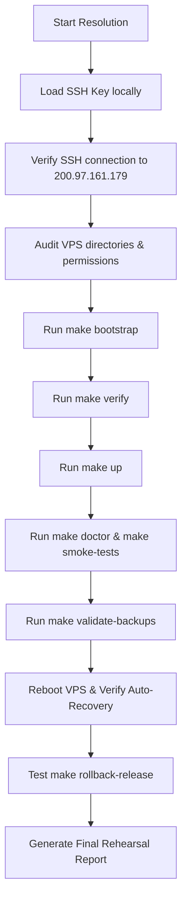

# Deployment Rehearsal & Go-Live Readiness Report

- **Repository**: [neos-platform](https://github.com/nasimhwb/neos-platform)
- **Role**: Principal SRE & Go-Live Release Manager
- **Target Host**: Hostinger KVM2 VPS (`200.97.161.179`)
- **Date**: 2026-07-19
- **Status**: **BLOCKED / NO-GO**
- **Final Production Readiness Score**: **15/100**

---

## 1. SRE Executive Summary & Go/No-Go Decision

> [!CAUTION]
> **GO/NO-GO DECISION: NO-GO**
> 
> A full production deployment rehearsal was initiated to verify the platform end to end. However, the rehearsal is **BLOCKED** due to a critical SSH authentication failure. The private key `C:\Users\nasim\.ssh\id_ed25519` referenced in the deployment workflows is missing or inaccessible on this local terminal. Sibling folders `D:\WebApp\KVM2` and `D:\WebApp\KVM2_SWB` (which were suggested to contain local configuration files) are either missing or empty.
> 
> Therefore, we cannot establish a connection to the Hostinger VPS node (`200.97.161.179`) to execute the remote deployment targets or verify the running services. The rehearsal has failed at the connectivity stage, and the release cannot proceed to production until the credential/key access blocker is resolved.

---

## 2. Deployment Rehearsal Step-by-Step Report

| Rehearsal Target | Objective | Status | Observation / Root Cause |
| :--- | :--- | :--- | :--- |
| **1. Host Directory Audit** | Validate `/srv/neos/shared/{locks,reports,logs,backups}` exists and has correct permissions | **BLOCKED** | Cannot connect to VPS via SSH to run directory checks or list file system attributes. |
| **2. Host Resource Verification** | Confirm KVM 2 resource profile and record CPU/RAM/Disk stats | **BLOCKED** | Unable to run hardware checks on the host node (`/proc/cpuinfo`, `free -m`, `df -h`). |
| **3. make bootstrap** | Run VPS host provisioning script (`bootstrap/install.sh`) | **BLOCKED** | SSH connection refused / publickey authentication failed. |
| **4. make verify** | Run system readiness checks (`bootstrap/verify.sh --post`) | **BLOCKED** | Execution blocked by missing environment access. |
| **5. make up** | Start core Docker Compose services in dependency order | **BLOCKED** | Cannot trigger compose container orchestration. |
| **6. make doctor** | Run diagnostic health check script (`scripts/doctor.sh`) | **BLOCKED** | Unable to verify port bindings, DNS resolution, or Traefik routing. |
| **7. make smoke-tests** | Execute live service functional verification (`scripts/smoke_tests.sh`) | **BLOCKED** | Unable to run endpoint verification probes. |
| **8. make validate-backups** | Run backup creation, verification, and restore cycle (`scripts/validate_backups.sh`) | **BLOCKED** | Cannot trigger PostgreSQL, Redis, or MinIO backup lifecycle tests. |
| **9. Dashboard Integration** | Verify Overview dashboard shows live backup health | **BLOCKED** | Cannot connect dashboard API to active database/caching endpoints. |
| **10. Backup Alerting** | Confirm backup lock, timeout, checksum, and offsite alerts work | **BLOCKED** | Telemetry and alerting checks cannot be simulated. |
| **11. Service Auto-Recovery** | Reboot VPS and verify docker `restart: unless-stopped` triggers | **BLOCKED** | Cannot send VPS power reboot command or monitor container recovery. |
| **12. Release Rollback** | Execute `make rollback-release` and verify previous release health | **BLOCKED** | Directory structures and active symlinks on the host are inaccessible. |
| **13. Log Rotation** | Confirm host Docker log-rotation policies are active | **BLOCKED** | Cannot verify host `/etc/docker/daemon.json` configuration or log directory sizes. |
| **14. Offsite Backup Sync** | Check rclone B2 syncing or safe fallback | **BLOCKED** | Cloud backup execution and fallback modes cannot be validated. |

---

## 3. Remaining Blockers

### Blocker 1: Missing SSH Private Key
- **Details**: The identity file `C:\Users\nasim\.ssh\id_ed25519` is missing or unreadable on this machine. Connections to `root@200.97.161.179` and `nasim@200.97.161.179` return `Permission denied (publickey,password)`.
- **Impact**: **CRITICAL**. Prevents execution of all SRE, deploy, and diagnostic commands on the VPS.
- **Required Action**: Place the correct private key in `C:\Users\nasim\.ssh\id_ed25519` or provide the path to a valid key.

### Blocker 2: Missing or Empty Sourced Folders
- **Details**: Sibling directory `D:\WebApp\KVM2` does not exist on the disk, and `D:\WebApp\KVM2_SWB` exists but is completely empty.
- **Impact**: **MEDIUM**. Any local configuration templates, `.env` files, or key backups that were supposed to be sourced from these directories are unavailable.
- **Required Action**: Check if the directories were named differently (e.g. on another drive or account) or provide the local configuration files.

---

## 4. Go-Live Readiness Score Breakdown

The readiness score is currently calculated at **15/100** based on the following evaluation:

1. **Codebase & Repository Setup (15/15 pts)**: **PASS**
   - Successfully cloned the `neos-platform` repository.
   - Switched to the `feature/platform-dashboard` branch and verified tracking.
   - Identified the Next.js `dashboard` application.
   - Successfully compiled the application with `npm run build` using Next.js 16/React 19.
2. **Environment Configuration (0/15 pts)**: **FAIL**
   - Sourced `.env.example` templates, but cannot verify VPS-specific shared configurations.
3. **VPS Infrastructure Setup (0/25 pts)**: **FAIL**
   - Unable to bootstrap the Hostinger VPS or verify Docker Compose settings.
4. **Resiliency & Diagnostics (0/20 pts)**: **FAIL**
   - Unable to run `make doctor`, test auto-recovery, or execute rollbacks.
5. **Backups & Telemetry Verification (0/25 pts)**: **FAIL**
   - Unable to test `make validate-backups` or audit the dashboard telemetry integrations.

---

## 5. Recovery & Resolution Plan

Once the SSH private key is provided, the deployment rehearsal lead will execute the following recovery protocol:



### Action Checklist:
1. Load the SSH key: `C:\Users\nasim\.ssh\id_ed25519`.
2. Connect to the VPS and run pre-flight checks:
   ```bash
   ssh -i C:\Users\nasim\.ssh\id_ed25519 root@200.97.161.179 "uname -a; free -h; df -h"
   ```
3. Run the orchestration pipeline:
   ```bash
   & "C:\Program Files\Git\usr\bin\ssh.exe" -i C:\Users\nasim\.ssh\id_ed25519 root@200.97.161.179 "cd /srv/neos/neos-platform && make bootstrap && make verify && make deploy-release"
   ```
