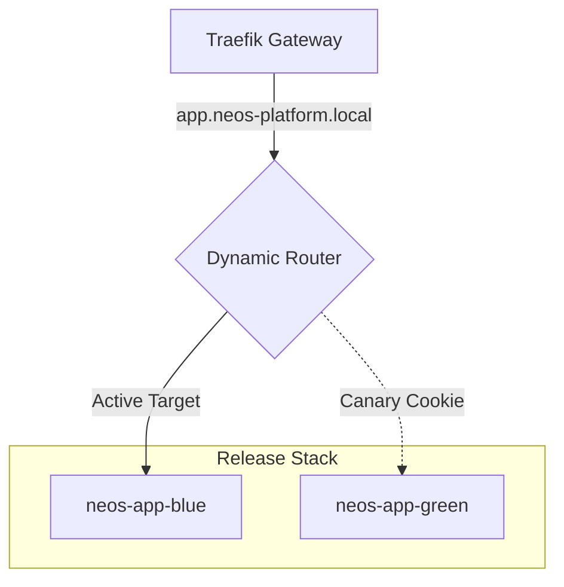

# Neos-App Migration Plan & Blue-Green Operations Guide

This document details the migration path of the Neos SaaS application (`neos-app`) from Supabase to the self-hosted NEOS Platform, alongside the Blue-Green zero-downtime deployment architecture.

---

## 1. Supabase to NEOS Platform Migration Plan

The migration preserves 100% compatibility with Supabase APIs (Auth, Storage, and Schema models) using our localized compatibility layers.

### Phase 1: Database Migration
1. **Schema and Data Export**: Export the database from the Supabase project:
   ```bash
   pg_dump -h db.supabase.co -U postgres -d postgres --clean --if-exists --no-owner --no-privileges | gzip > supabase_backup.sql.gz
   ```
2. **Schema Compatibility**: The target database contains extensions (`uuid-ossp`, `pgcrypto`, `pg_stat_statements`) and system roles (`anon`, `authenticated`, `service_role`, `authenticator`, `supabase_admin`) pre-installed on startup via [02-supabase-compat.sql](file:///d:/Webapp/KVM2/neos-platform/configs/postgres/init-scripts/02-supabase-compat.sql).
3. **Data Import**: Re-import the schema into our local `neos_app` database:
   ```bash
   gunzip -c supabase_backup.sql.gz | docker exec -i neos_postgres psql -U postgres -d neos_app
   ```

### Phase 2: Object Storage Migration
Supabase Storage is S3-compatible. We migrate assets directly to MinIO:
1. Set up CLI aliases for both the source Supabase bucket and local MinIO:
   ```bash
   mc alias set supabase https://xxx.supabase.co/storage/v1/s3 access_key secret_key
   mc alias set local http://localhost:9000 admin admin_password
   ```
2. Mirror the contents of the Supabase bucket to our local `supabase-storage` bucket:
   ```bash
   mc mirror supabase/supabase-bucket local/supabase-storage
   ```

### Phase 3: Application Cache Alignment
Verify that `neos-app` environment settings point to our high-performance Redis cache instance:
- Host: `cache`
- Port: `6379`
- Database index: `4` (dedicated partition)

---

## 2. Zero-Downtime Blue-Green Deployments

To ensure zero downtime, `neos-app` utilizes a parallel container architecture coupled with Traefik's dynamic config routing.



### The Deployment Loop (`deploy-release.sh`)
1. **Target Detection**: Reads `configs/traefik/dynamic.yml` to identify the active color container (e.g. `blue`).
2. **Sidecar Startup**: Builds and boots the new release code on the *inactive* container (e.g. `green`) without affecting production traffic:
   ```bash
   docker compose --profile apps up -d --build neos-app-green
   ```
3. **Canary Cookie Testing**: Developers can preview the new release immediately by setting a browser cookie `deploy_color=green`.
4. **Automated Healthcheck**: Polls the new container's HTTP endpoint.
5. **Atomic Traffic Swap**: If healthy, swaps the server URL in `dynamic.yml` to point to `green` and modifies the `current` symlink. Traefik hot-reloads routing instantly.
6. **Reclaim Resources**: Stops the old container (`neos-app-blue`) to save memory.

### Rollback Strategy
* **Pre-Swap Rollback (Automated)**: If healthchecks on the new container fail before traffic swap, the script stops the container, cleans the build folder, and exits. Production traffic is never routed to the failing release.
* **Post-Swap Rollback (Manual)**: If bugs are discovered after traffic swap, execute the rollback script:
   ```bash
   ./scripts/rollback.sh
   ```
   This reverts the code symlink and swaps Traefik back to the previous release color.
